

<picture>
  <source media="(prefers-color-scheme: dark)" srcset="./assets/hero-dark.svg">
  <source media="(prefers-color-scheme: light)" srcset="./assets/hero-light.svg">
  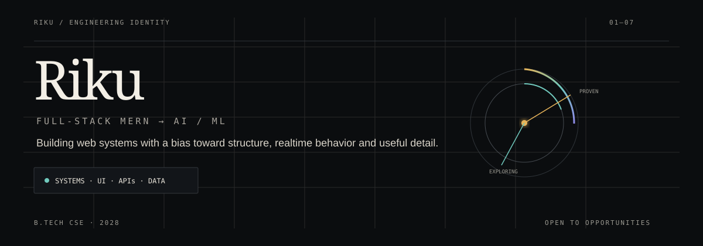
</picture>

<picture>
  <source media="(prefers-color-scheme: dark)" srcset="assets/snapshot-dark.svg">
  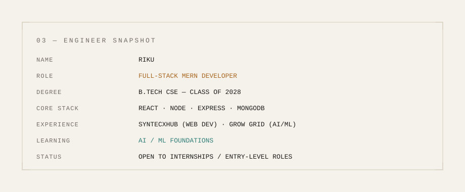
</picture>

<!-- 
## 01 / Engineer Snapshot -->
<!-- > **Full-Stack MERN Developer** building web systems with React, Node.js, Express and MongoDB — currently extending that foundation into **AI/ML**.

| | |
|---|---|
| **Education** | B.Tech CSE · 2028 |
| **Proven** | MERN · REST APIs · Authentication · Realtime systems |
| **Exploring** | AI/ML · Python · NumPy · Pandas |
| **Experience** | Syntecxhub — Web Development · Grow Grid — AI/ML |
| **Status** | Open to internships + entry-level software engineering roles | -->

<table width="100%" bgcolor="#08090B">
<tr>

<!-- ========================================================= -->
<!-- PROJECT 01 -->
<!-- ========================================================= -->

<td width="50%" valign="top" bgcolor="#08090B">

<h2>03 / SHIPPED SYSTEMS</h2>
<picture>
  <source media="(prefers-color-scheme: dark)" srcset="./assets/project-chat.svg">
  <source media="(prefers-color-scheme: light)" srcset="./assets/project-chat-light.svg">
  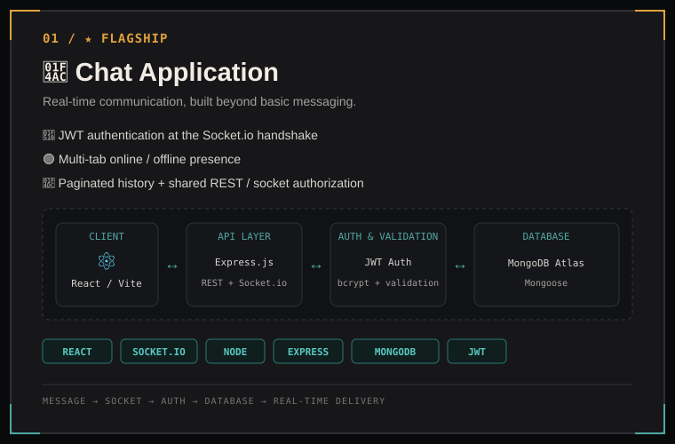
</picture>

&nbsp;

&nbsp;

</td>

<!-- ========================================================= -->
<!-- PROJECT 02 -->
<!-- ========================================================= -->

<td width="50%" valign="top" bgcolor="#08090B">
 
 
 

<picture>
  <source media="(prefers-color-scheme: dark)" srcset="./assets/project-task.svg">
  <source media="(prefers-color-scheme: light)" srcset="./assets/project-task-light.svg">
  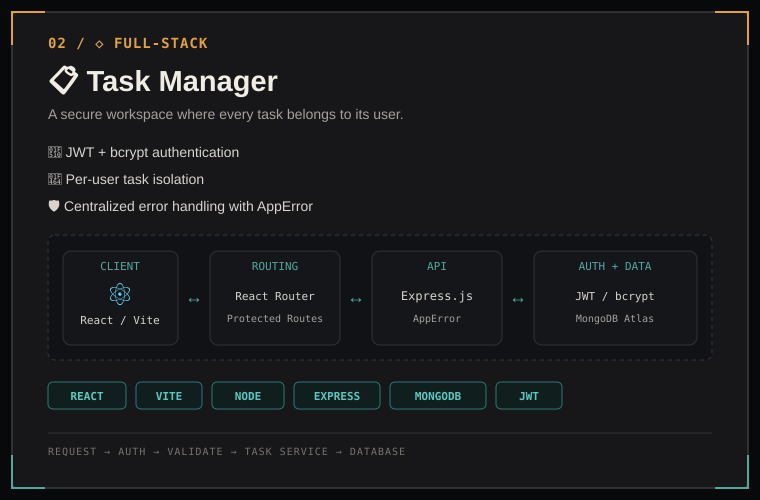
</picture>

&nbsp;

&nbsp;

</td>

</tr>

<tr>

<!-- ========================================================= -->
<!-- PROJECT 03 -->
<!-- ========================================================= -->

<td width="50%" valign="top" bgcolor="#08090B">

<picture>
  <source media="(prefers-color-scheme: dark)" srcset="./assets/project-user.svg">
  <source media="(prefers-color-scheme: light)" srcset="./assets/project-user-light.svg">
  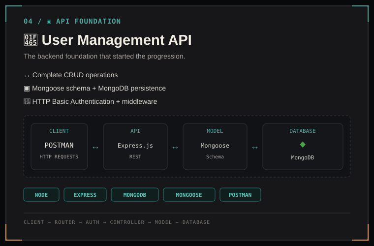
</picture>

&nbsp;

&nbsp;

</td>

<!-- ========================================================= -->
<!-- PROJECT 04 -->
<!-- ========================================================= -->

<td width="50%" valign="top" bgcolor="#08090B">

<picture>
  <source media="(prefers-color-scheme: dark)" srcset="./assets/project-notes.svg">
  <source media="(prefers-color-scheme: light)" srcset="./assets/project-notes-light.svg">
  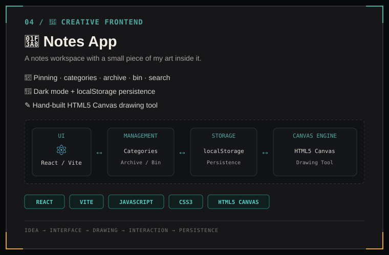
</picture>

&nbsp;

&nbsp;

</td>

</tr>
</table>

<picture>
  <source media="(prefers-color-scheme: dark)" srcset="./assets/capability-map-dark.svg">
  <source media="(prefers-color-scheme: light)" srcset="./assets/capability-map-light.svg">
  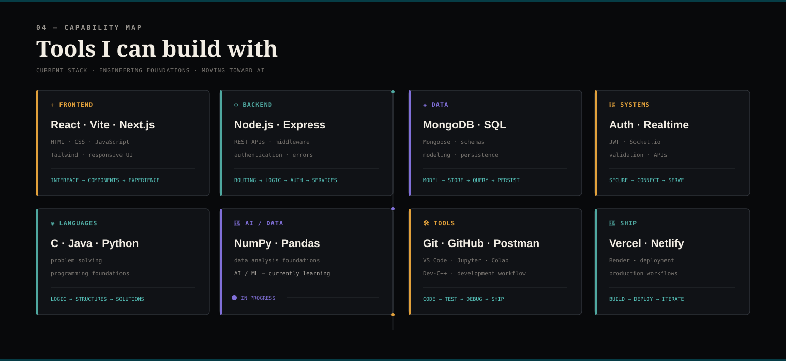
</picture>

<picture>
  <source
    media="(prefers-color-scheme: dark)"
    srcset="./assets/github-stats.svg">

  <source
    media="(prefers-color-scheme: light)"
    srcset="./assets/github-stats-light.svg">

  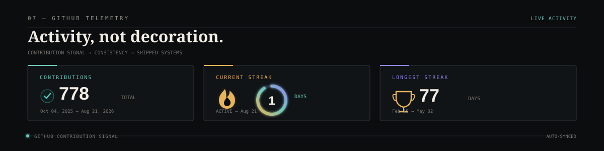
</picture>

<picture>
  <source media="(prefers-color-scheme: dark)" srcset="./assets/contribution-history.svg">
  <source media="(prefers-color-scheme: light)" srcset="./assets/contribution-history-light.svg">
  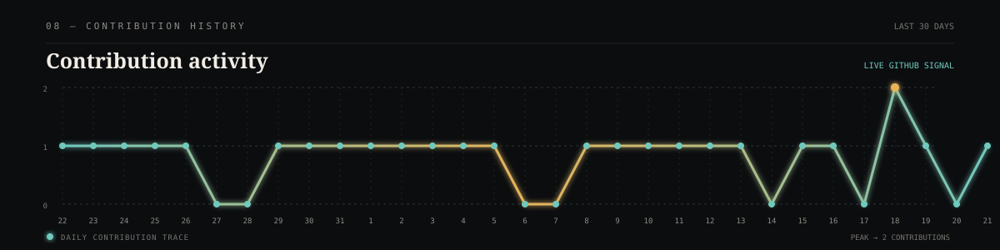
</picture>

<!-- ## 05 / Capability Map -->

<picture>
  <source media="(prefers-color-scheme: dark)" srcset="./assets/engineering-vector-dark.svg">
  <source media="(prefers-color-scheme: light)" srcset="./assets/engineering-vector-light.svg">
  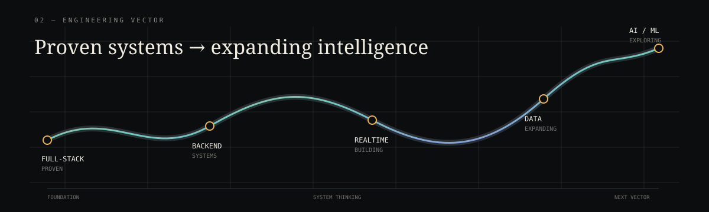
</picture>

<picture>
  <source media="(prefers-color-scheme: dark)" srcset="./assets/beyond-code-dark.svg">
  <source media="(prefers-color-scheme: light)" srcset="./assets/beyond-code-light.svg">
  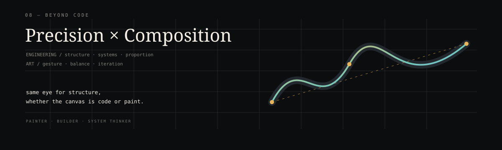
</picture>

---

